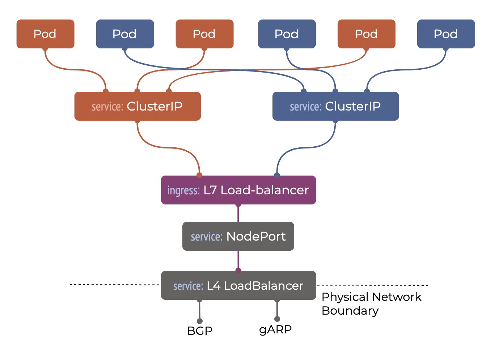

# K8S 实战

搭建一套面向 AI 生产可用 K8S 集群

## 基础

目前 K8S 主流发行版本有 [k0s](https://docs.k0sproject.io/stable/), [k3s](https://k3s.io/), [k8s](https://kubernetes.io/docs/reference/setup-tools/kubeadm/) 和 [eks](https://distro.eks.amazonaws.com/) 可以选择一个偏好的，本实战项目是基于 k3s：

1. [准备](docs/0-prepare.md)
2. [安装 k3s](docs/1-k3s.md)
3. [常用客户端](docs/2-tools.md)

## 存储

k3s 缺省安装 local-path 存储，适合缓存数据或者支持 HA 的数据库使用。

如果需要持久存储，不需要 HA 支持的情况下可以使用 NFS，需要 HA 支持可以使用 Rook (Ceph)。

多个存储可以同时并存。

1. [部署存储 NFS CSI](nfs-csi/README.md)
2. [部署存储 Rook (Ceph)](rook/README.md)

## 网络

- CNI: 解决 Pod 与 Pod 间 IP 互通, 用于东西流量通信
  - k3s 缺省使用 Flannel (vxlan backend), 特点开销低. 另外 kube-router 也出现竞争优势, 但需要评估稳定性
  - 可替代方案 Cilium, 在大规模高负载场景中基于 eBPF 优势大
  - 不同 CNI 选择参考 [Benchmark results of Kubernetes network plugins (CNI) over 40Gbit/s network](https://itnext.io/benchmark-results-of-kubernetes-network-plugins-cni-over-40gbit-s-network-2024-156f085a5e4e)
- Service: 分布式负载均衡器
  - Headless: 通过 DNS 实现，查询 DNS 获得所有 Pod IP。通常用于 StatefulSet 负载 （Database 等），其自己处理连接
  - ClusterIP: 分配一个唯一 VIP （不能 Ping），在每个节点设置 DNAT 其负责在 Client 端转换 VIP 到 Pod ID. 通常用于 Deployment 无状态服务
  - NodePort: 构建在 ClusterIP 之上在 root network namespace 中分配一个唯一的静态 port. 当流量从任意 node 到达此静态 port 时它会转发流量到一个健康的 Pod 上
  - LoadBalancer: 使用外部的用户流量到达集群中。每个 LoadBalancer Service 都会分配一个可路由的 IP 通过 BGP 或者 ARP 通告底层物理网络上。通常云上提供外部 L4 负载均衡器，或者私有集群使用 MetalLB
  - Service Mesh: 用于集群内应用程序间流量管理, 可观测性和安全性。常见方案有 Istio 和 Gateway API
- Ingress & Egress: 用于集群南北流量通信
  - Ingress API: 将流量传入集群内不同服务的原始方式. 通常使用 Nginx 等
  - Gateway API: Ingress API 改进版本
  - Egress: 缺省不进行任何限制出口流量
- Other
  - Network Policy: 过滤 Pod 流量, 用于限制 Pod 间通信. 通常用于隔离不同用户间 Pod 通信
  - DNS: 用于集群服务发现, 通常使用 CoreDNS
  - TLS: 用于创建 TLS 证书，常见开启 Ingress 的 HTTPS 依赖 TLS. 通常使用 CertManager

1. [部署 LoadBalancer MetalLB](metallb/README.md)
2. [部署 Ingress Nginx](nginx/README.md)
3. [部署 CertManager](cert-manager/README.md)

> 深入阅读 [THE KUBERNETES NETWORKING GUIDE](https://www.tkng.io/)

## 监控

1. [部署 Metric 监控 VictoriaMetrics](vm/README.md)
2. 部署日志监控 Loki

## 数据库

## AI

1. [部署 Node Feature Discovery](nfd/README.md)
2. [部署 GPU Operator 支持 GPU 设备](gpu-operator/README.md)
3. [部署 Network Operator 支持 Infiniband/RoCE 设备](network-operator/README.md)

### 推理

1. [部署 Ollama + Open WebUI 推理服务](ollama/README.md)
2. 部署 Serverless 服务 KNative
3. 部署推理服务 KServe + vLLM

### 训练

1. [部署 MPI Operator 支持训练](mpi-operator/README.md)
2. 部署 Training Operator
